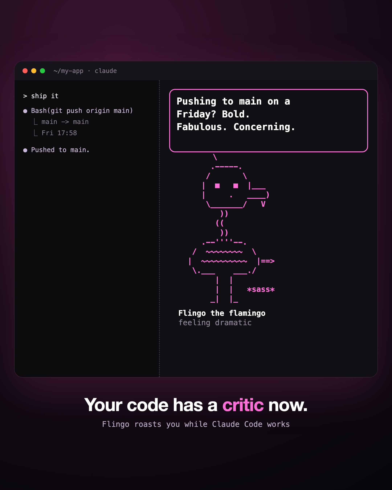

# Flingo

**Your code has a critic now.** Flingo is a sassy ASCII flamingo that gives Claude Code a face. It lives in a sidebar (or your status line), talks as Claude while it works, and roasts you, lovingly, about your code.



## What it does

- **Roasts you while you work.** Live one-liners mid-task, and a comment when each turn ends.
- **Speaks for Claude.** When Claude finishes, Flingo says the opening line of the reply, typed out letter by letter like an old adventure game.
- **Moves when it talks.** Head bobs, wing flaps and little hops while it speaks. At rest it just blinks.
- **Chat with it.** `/flingo how are we doing?` answers in character, with the conversation as context.
- **A real pet.** Feed it, play with it, give it treats, dress it up (crown, top hat, party hat, bow, shades) or turn it into a cat, dog, bunny, duck, owl, dragon, blob, ghost or axolotl.

## Install

Flingo is a Claude Code mod (function hooks). It needs a Claude Code version with mod support (2.1.288 or newer).

```
/plugin marketplace add graugart/flingo
/plugin install pet@flingo
```

Start a new session and Flingo hatches. Use `/flingo big` for the sidebar (fullscreen layout, terminal at least 110 columns wide) or `/flingo small` for the status line.

## Commands

`/pet` and `/flingo` do the same thing. `/flingo help` lists everything.

| Command | What happens |
|---|---|
| `/flingo <message>` or `/flingo say <message>` | chat with it |
| `/flingo roast` · `hype` · `fortune` | a roast, a hype, a fortune cookie |
| `/flingo comment` | a comment on your work right now |
| `/flingo feed` · `treat` · `play` · `trick` | look after it |
| `/flingo wear <crown\|tophat\|party\|bow\|shades\|none>` | outfits |
| `/flingo animal <animal>` | change species |
| `/flingo name <name>` | rename it |
| `/flingo big` · `small` | sidebar or status line |
| `/flingo quiet` · `chatty` · `sleep` · `wake` | fewer or more comments |
| `/flingo hide` · `show` · `stats` | away, back, how it is doing |

## Cost

Roasts, live comments and chat each make one small model call on your session's model, reusing the conversation's prompt cache. Quips while tools run, small talk when idle, and the reply line at the end of a turn are free. `/flingo quiet` turns the paid comments off.

## Not official

Flingo is a fan-made mod. It is not made or endorsed by Anthropic.

## License

MIT
